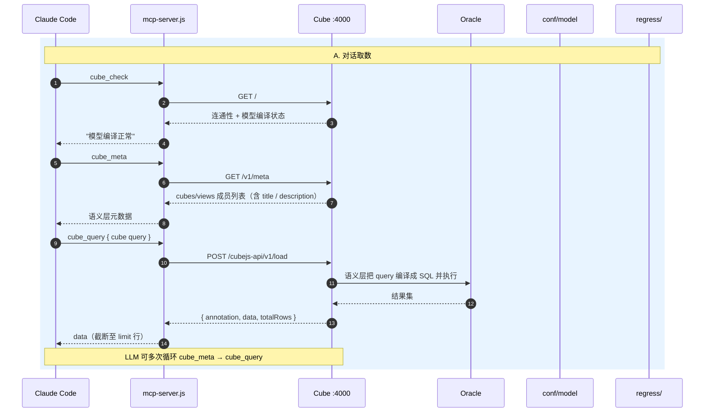
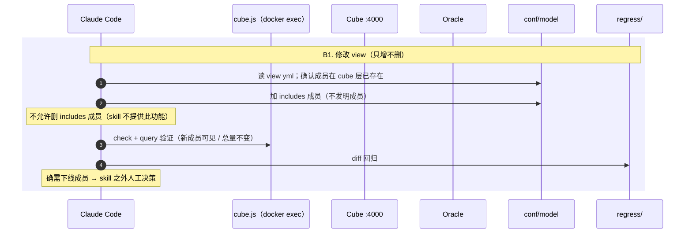
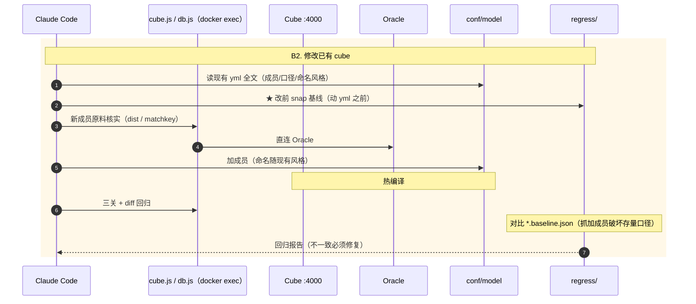
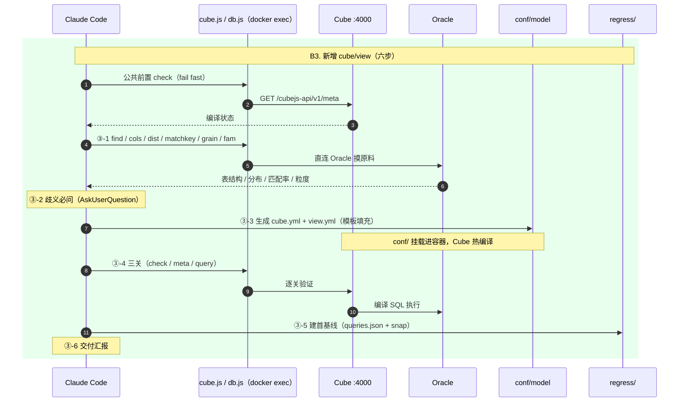

# Cube Agent-to-Agent 架构：MCP / REST API 与本地服务的关系

> 本文记录：如何让 Claude Code 和自研 agent 通过 REST/SQL API 包装成 tool 对接本地 Cube，
> 包括开发架构总图、消息流动、时序图，以及与 Cube 官方 Chat API（Agent-to-Agent recipe）的对照。
> 运行时问数流程（五阶段与准确性保障）见姊妹篇：[cube-agent-ask.md](cube-agent-ask.md)。
>
> 背景参考：https://docs.cube.dev/recipes/ai/agent-to-agent 、https://docs.cube.dev/reference/embed-apis/chat-api

---

## 一、概念区分：语义层\MCP\Agent

```
┌─ conf/model/ (cubes、views、macros、globals.py)  ←── 语义层本体：口径、join、权限
│        ↑ 编译
├─ Cube server :4000                                ←── 语义层的运行时 + REST API
│        ↑ HTTP (4 个端点)
├─ agent/mcp-server.js                              ←── MCP 只是个协议适配器（~150行薄壳）
│        ↑ MCP 协议
└─ Claude Code / 你的 agent                          ←── 调用方
```

1. **语义层本体是 `conf/model`** —— cube/view 定义里的 `title`、`description`、measure
   口径、join 规则，才是"给 agent 看的文档"。`cube_meta` 有用，是因为它把模型里
   人写的 description 透传给 agent，agent 才知道某指标是什么口径、该用哪个成员。

2. **MCP server 只是协议转换** —— 四个 tool 每一个都几乎是一对一地映射到 Cube
   已有的 REST 端点：

   | tool | 功能说明 | 对应端点 | 新增逻辑 |
   |---|---|---|---|
   | `cube_check` | 健康检查：连通性 + 模型编译状态，出错时最先调用 | GET `/` | 无 |
   | `cube_meta` | 列出 cubes/views 及成员（title/description/type），是 agent 选指标、维度的依据 | GET `/v1/meta` | 无 |
   | `cube_query` | 执行语义层查询（measures/dimensions/timeDimensions/filters/limit），返回数据 | POST `/v1/load` | 只加行数上限 |
   | `cube_sql` | 返回某 query 编译生成的 SQL，用于核对口径、透明度和回归 diff | POST `/v1/sql` | 无 |

   它自己**不含任何语义**——所以叫"薄壳"。`agent/cube.js` 干的其实是同一件事，
   只是协议从 MCP 换成了"Bash + CLI 参数"。换协议的理由是调用方体验，不是语义：
   Claude Code 对 MCP tool 有原生支持（自动发现、schema 校验、参数结构化）。

3. **tool 数量不是定的** —— 以后要加"跑回归"（`snap`/`diff`）、"db 探索"
   （db.js 的 tables/cols/find），都是往这个 MCP 上加 tool，语义层本体不用动。

一句话：**语义层（conf/model + Cube server）是资产，MCP 是把这份资产暴露给
智能体的标准插头。**

---

## 二、开发架构总图（组件与部署关系）

```
┌─────────────────────────── Windows 宿主机 (D:\develop\cube) ───────────────────────────┐
│                                                                                          │
│  调用方层                       tool 层（协议适配，不含语义）                              │
│  ┌──────────────┐              ┌──────────────────────┐                                   │
│  │ Claude Code  │──MCP协议──▶  │ agent/mcp-server.js  │──┐   (拟新增，~150行薄壳)          │
│  │  (/mcp 发现) │              │  4 tools:            │  │                                │
│  └──────────────┘              │   cube_check         │  │                                │
│  ┌──────────────┐              │   cube_meta          │  │                                │
│  │ cube-modeling │──Bash────▶   │   cube_query         │  │                                │
│  │ skill (现有) │              │   cube_sql           │  │                                │
│  └──────┬───────┘              └──────────────────────┘  │                                │
│         │(现有方式)              ┌──────────────────────┐  │                                │
│         └──────────────────▶  │ agent/cube.js (CLI)  │──┤  (现有，Bash调用 REST)          │
│                                └──────────────────────┘  │                                │
│                                ┌──────────────────────┐  │                                │
│  你的 agent (Python,拟新增) ──▶│ agent/cube_tools.py  │──┤  (形态二，函数tool)             │
│                                └──────────────────────┘  │                                │
│                                                          │                                │
│  语义层资产（agent 真正"看"的东西）                        ▼ HTTP :4000                     │
│  ┌──────────────────────────────────────────────────┐    │                                │
│  │ conf/model/                                      │    │                                │
│  │   cubes/ views/ macros/ globals.py ←─cube-modeling│    │                                │
│  │   (指标口径、维度、join、Jinja动态模型)  生成/维护 │    │                                │
│  └──────────────────────────────────────────────────┘    │                                │
│  ┌──────────────────────────────────────────────────┐    │                                │
│  │ regress/  (bill_kpi / cbill / paybook / stock)   │    │                                │
│  │   *.baseline.json + *.queries.json  ←─回归体系    │    │                                │
│  └──────────────────────────────────────────────────┘    │                                │
│                                                          │                                │
│  ┌─ Docker (cube-net: 192.168.220.0/24, 避开172.18) ────│────────────────────┐           │
│  │  ┌─────────────────────────────────────┐             ▼                 │           │
│  │  │ 容器 cube (cube-oracle:local)       │  REST API ◀──:4000           │           │
│  │  │                                     │  SQL API  ◀──:15432          │           │
│  │  │  Cube server (v1.7.42, dev模式)     │                               │           │
│  │  │   ├─ 挂载 /cube/conf   ← conf/      │── 模型编译                    │           │
│  │  │   ├─ 挂载 /cube/agent  ← agent/     │── db.js/cube.js 容器内跑      │           │
│  │  │   └─ oracledb thick + .env 连接配置  │                               │           │
│  │  └──────────────┬──────────────────────┘                               │           │
│  └─────────────────│──────────────────────────────────────────────────────┘           │
└────────────────────│───────────────────────────────────────────────────────────────────┘
                     ▼ Oracle thick 连接 (1521)
              ┌──────────────┐
              │ Oracle 服务器 │ 172.18.163.68 (公司内网)
              │  FAB_AGEN_*  │
              └──────────────┘
```

**要点**：MCP / cube.js / cube_tools.py 三个形态是**并列的三个插头**，插的是同一个
REST API，语义全部在 `conf/model` 和 Cube server 里。tool 层换协议不动语义。

> **容器化更新（2026-09-22）**：cube.js 与 db.js 均已改为**在 `cube` 容器内运行**
> （`docker exec cube sh -c "node /cube/agent/..."`，`agent/` 与 `regress/` 目录挂载），
> **宿主机零依赖**——只需 Docker + Claude Code，迁移 Linux 服务器时"宿主机装 Node"
> 一条从清单划掉。apiSecret 固定在 `.env` 的 `CUBEJS_API_SECRET`（env_file 注入容器，
> 重启不变），上图中 cube.js CLI 的 HTTP 调用改为容器内 localhost:4000。

---

## 三、消息流动：一次 `cube_query` 的完整路径

```
用户: "上月各票种开票金额？"
   │
   ▼ ①
Claude Code (LLM 决定需要数据)
   │ MCP: tools/call {name:"cube_meta"}          ← 先看模型，确认成员名
   ▼
mcp-server.js ──HTTP──▶ Cube /v1/meta
   │◀── {cubes:[{name, title, measures, dimensions...}]}   ← conf/model 里的
   │                                                          title/description 透传给 LLM
   ▼ ②
Claude Code (LLM 组装 cube query，而不是写 SQL)
   │ MCP: tools/call {name:"cube_query", arguments:{
   │    query:{ measures:["bill.amount"],
   │             timeDimensions:[{dimension:"bill.dt",
   │                             dateRange:["2026-08-01","2026-08-31"],
   │                             granularity:"month"}],
   │             dimensions:["bill.ticket_type"] }}}
   ▼
mcp-server.js ──HTTP POST──▶ Cube /cubejs-api/v1/load   (Authorization: apiSecret)
   │
   │                              Cube server 内部：
   │                              语义层把 cube query 编译成 SQL ──▶ Oracle
   │                              ◀── 结果集（join/口径/权限都在这层生效）
   │◀── {annotation:{...}, data:[...], totalRows}
   ▼
mcp-server.js 截断至 limit 行，包成 MCP 响应
   │◀── tool result (JSON)
   ▼ ③
Claude Code (LLM 汇总结论、组织回答)
   │
   ▼
用户: "上月开票总额 X 万，票种 A 占比 60%..."
```

①②③ 对应 recipe 的分工：**调用方决定"何时/如何组织"，语义层决定"怎么查"**。

---

## 四、时序图：对话取数 + 模型修改回归（两条泳道）

**A. 对话取数（每次问答都会发生的）：**



**B1. 修改 view（只增不删，最轻量）：**



**B2. 修改已有 cube（加度量/加维度，偶尔发生的）：**



**B3. 新增 cube/view（六步 + 建首基线，最重、偶尔发生的）：**



**A 泳道**是运行时消息流：每次用户提问，`cube_meta → cube_query` 两步循环，
LLM 可多次调用（单次问答内部的五阶段拆解与准确性保障见
[cube-agent-ask.md](cube-agent-ask.md)）。
**B 泳道**是开发期消息流：模型文件改在宿主机 `conf/`（挂载进容器，Cube 自动热编译），
改完用 `cube.js sql`（docker exec）看编译出的 SQL、用 regress 体系做回归——
这是 `cube-modeling` skill 已有的闭环，MCP 化后 `cube_sql`/`cube_query` 只是让
这个闭环里 agent 能自己动手。

---

## 五、tool 层三种形态的代码骨架

### 形态一：Claude Code 对接 —— MCP server（拟新增）

```js
// agent/mcp-server.js  (stdio MCP, Node, 复用 cube.js 的 getSecret/api)
server.setRequestHandler(CallToolRequestSchema, async ({ params }) => {
  switch (params.name) {
    case 'cube_meta':  return json(await api('GET', '/v1/meta'));
    case 'cube_query': {
      const { query, limit = 100 } = params.arguments;
      const r = await api('POST', '/cubejs-api/v1/load', { ...query, limit });
      return json({ annotation: r.annotation, data: r.data.slice(0, limit),
                    totalRows: r.totalRows ?? r.data.length });  // 行数上限防刷屏
    }
    case 'cube_sql':   return json(await api('POST', '/cubejs-api/v1/sql', params.arguments.query));
    case 'cube_check': ...
  }
});
```

注册到 `.mcp.json`：

```json
{ "mcpServers": { "cube": { "command": "node", "args": ["agent/mcp-server.js"] } } }
```

tool description 里写清"先 cube_meta 找指标/维度，再 cube_query"。

### 形态二：自研 agent 对接 —— Python 函数 tool（拟新增）

```python
# agent/cube_tools.py
import json, os, requests

CUBE = os.getenv("CUBE_API_URL", "http://localhost:4000")
SECRET = os.getenv("CUBEJS_API_SECRET")          # dev 模式下是明文 apiSecret

def _headers(token: str | None = None):
    # 生产模式：换成签发的 JWT（带 securityContext / scope），Cube 层 RLS 自动生效
    return {"Authorization": token or SECRET, "Content-Type": "application/json"}

def cube_query(query: dict, token: str | None = None) -> str:
    """执行语义层查询。query 格式: {measures:[], dimensions:[],
    timeDimensions:[{dimension, dateRange:[起,止], granularity}],
    filters:[{member, operator, values}], limit}。先调 cube_meta 确认成员名。"""
    r = requests.post(f"{CUBE}/cubejs-api/v1/load",
                      headers=_headers(token), json=query, timeout=120)
    r.raise_for_status()
    d = r.json()
    return json.dumps({"annotation": d.get("annotation"),
                       "data": d.get("data", [])[:100], "totalRows": d.get("totalRows")})
```

- **用户上下文/RLS**：`token` 参数传签了 `securityContext` 的 JWT，Cube 层
  access policies 自动过滤，agent 代码零改动——是 Chat API
  `sessionSettings.userAttributes` 的本地等价物。
- **多轮上下文**：REST API 没有 `chatId`，会话记忆由编排 agent 自己持有
  （这正是 agent-to-agent 模式下编排层该干的事）。

### 形态三（现有）：cube.js CLI

`agent/cube.js` —— check / meta / query / snap / diff。2026-09-22 起在 `cube`
容器内运行（`docker exec cube sh -c "node /cube/agent/cube.js ..."`），
`cube-modeling`/`cube-ask` skill 以此形态调用，与 MCP 形态可共存过渡。

---

## 六、鉴权分层

| 场景 | 鉴权 | 说明 |
|---|---|---|
| dev（现状） | `.env` 固定 `CUBEJS_API_SECRET`（env_file 注入容器，重启不变；cube.js 优先读 env） | 开发态固定凭据 |
| 生产 | 签发 JWT：`{securityContext, scope}` + `CUBEJS_API_SECRET` 签名 | 对应 Chat API 的 Cube token 模式，RLS/权限全在 Cube 层生效 |

---

## 七、与 Cube 官方 Chat API 的对照

| | Cube Cloud Chat API | 本地方案（REST 包装成 tool） |
|---|---|---|
| AI Agent | 托管在 `ai.{region}.cubecloud.dev` | Claude Code / 自研 agent 充当 |
| 流式协议 | NDJSON（`stream-chat-state`），`graphPath` 标识 agent 图节点 | 无流式，tool 同步返回 JSON |
| 会话记忆 | `chatId` / `__cutoff__` 续聊 | 编排 agent 自己持有 |
| 用户上下文/RLS | `sessionSettings.userAttributes` 或 Cube token securityContext | JWT securityContext 传给 `/v1/load` |
| 幂等 | `messageId`（`<13位毫秒时间戳>-message`） | 不适用（同步调用） |
| 内部工具 | `cubeMeta` / `cubeSqlApi`（对调用方透明） | `cube_meta` / `cube_sql`（同构） |
| 计划要求 | Premium / Enterprise | 无（本地 OSS v1.7.42） |

值得注意的坑（来自 Chat API 文档，同思路适用于本地对接）：
- tool 返回的数据要设行数上限，防止刷爆 LLM 上下文（Chat API 默认截 100 行，
  全量要拿生成的 SQL 去 Cube API 拉取）
- 鉴权错误可能藏在 HTTP 200 的错误体里，不能只看状态码

---

## 八、各层职责一览

| 层 | 位置 | 职责 | 变更频率 |
|---|---|---|---|
| 调用方 | Claude Code / 自研 agent | 何时取数、组织问题、汇总结论 | 常变 |
| tool 层 | mcp-server.js / cube.js / cube_tools.py | 协议转换 + 行数上限等防护 | 少变 |
| 语义层 | conf/model + Cube server :4000 | 口径、join、权限、SQL 生成 | 随业务变 |
| 数据层 | Oracle 172.18.163.68 | 原始数据 | 不动 |

## 九、落地顺序

1. **cube-ask skill（问数契约）**——零新代码，复用 cube.js；准确性的增量全在
   契约里，先跑起来（设计见 [cube-agent-ask.md](cube-agent-ask.md)）
2. **MCP server**（形态一）——体验升级（自动发现、schema 校验），与
   cube-modeling / cube-ask skill 共存过渡
3. **再抽 Python 客户端**（形态二）——与 MCP server 共享同一套 tool 语义
4. **回归体系复用**——`regress/` 的 baseline/diff 已有，`cube_sql` tool 让
   agent 改模型后能自己跑回归
