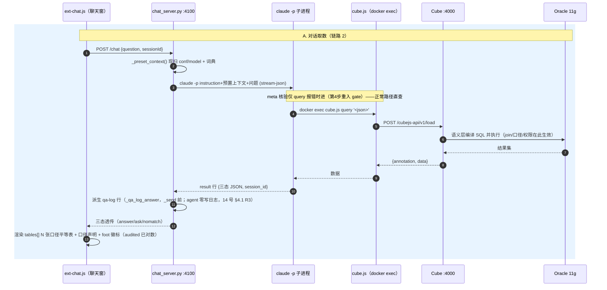
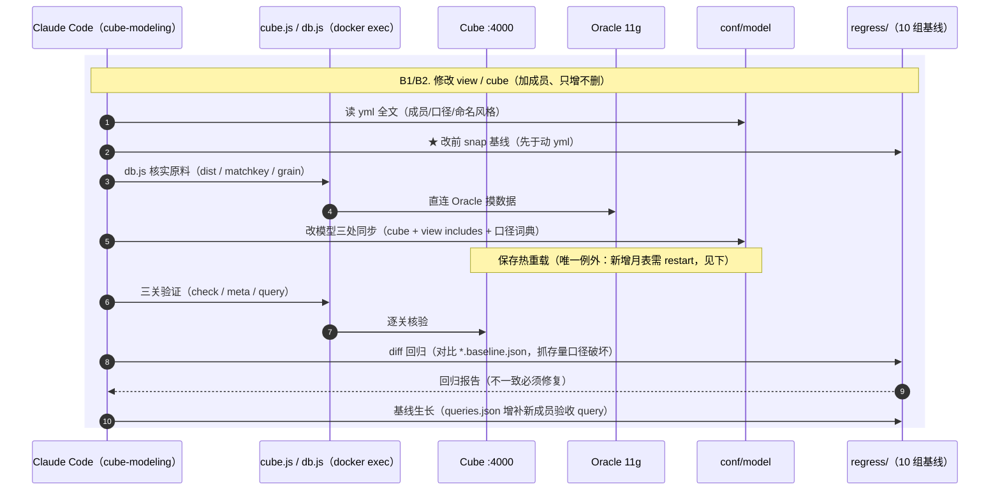

# Cube Agent 架构（demo 现状 + MCP 演进方向）

> 本文是项目**总架构文档**，以当前代码仓实际状态为准，基础沿用
> [01-cube-agent-architecture.md](01-cube-agent-architecture.md)（MCP 视角的规划篇）。
> 两者关系：规划篇描述"语义层 + REST 包装成 tool"的目标形态，本篇描述**已落地的
> demo 架构**（skill + CLI + chat 桥），并把 MCP server 保留为**下一步演进方向**——
> 目前只是 demo，MCP 未落地。
>
> 运行时问数流程（五阶段与准确性保障）见姊妹篇：[01-cube-agent-ask.md](01-cube-agent-ask.md)；
> 消息逐跳细节见 [13-前端到claude到cube消息传递路径.md](13-前端到claude到cube消息传递路径.md)；
> 日志规格见 [14-日志规格.md](14-日志规格.md)。
>
> 背景参考：https://docs.cube.dev/recipes/ai/agent-to-agent 、https://docs.cube.dev/reference/embed-apis/chat-api

---

## 一、概念区分：语义层 \ tool 层 \ Agent

```
┌─ conf/model/ (cubes、views、macros、globals.py)  ←── 语义层本体：口径、join、权限
│        ↑ 编译
├─ Cube server :4000                                ←── 语义层的运行时 + REST API
│        ↑ HTTP / docker exec
├─ tool 层：agent/cube.js、agent/db.js、chat/chat_server.py  ←── 协议适配，不含语义
│        ↑ CLI / HTTP
└─ 调用方：Claude Code skill / Playground 聊天窗 / 你的 agent        ←── 调用方
```

1. **语义层本体是 `conf/model`** —— cube/view 定义里的 `title`、`description`、
   measure 口径、join 规则，才是"给 agent 看的文档"。`/v1/meta` 有用，是因为它把
   模型里人写的 description 透传给 agent，agent 才知道某指标是什么口径、该用哪个成员。

2. **tool 层只是协议转换，不含任何语义** —— 当前 demo 实际在用的 tool 层：

   | 组件 | 形态 | 功能 | 对应 Cube 端点 |
   |---|---|---|---|
   | `agent/cube.js` | CLI（docker exec，**在用**） | secret / check / meta / query / snap / diff | GET `/`、GET `/v1/meta`、POST `/v1/load` |
   | `agent/db.js` | CLI（docker exec，**在用**） | 库表探查 9 子命令：tables / cols / count / sql / find / dist / matchkey / grain / fam | 直连 Oracle（绕过语义层） |
   | `chat/chat_server.py` | HTTP 桥 :4100（**在用**） | 聊天窗后端：HTTP ⇄ `claude -p` 子进程，会话锁 / 预置上下文 / 三态透传 | 由 claude 会话间接调 |
   | `agent/mcp-server.js` | MCP server（**拟新增，下一步演进**） | 四 tool：cube_check / cube_meta / cube_query / cube_sql | 同 cube.js，见 §六 |
   | `agent/cube_tools.py` | Python 函数 tool（**拟新增**） | 自研 agent 对接 | POST `/v1/load` |
   | `agent/ledger.js` | CLI（**设计定稿，未落盘**，18 号） | 未建模清单 survey / check / show | 读 `conf/unmodel/*.json` |

3. **调用方决定"何时/如何组织"，语义层决定"怎么查"** —— 换 tool 层协议不动语义。

一句话：**语义层（conf/model + Cube server）是资产，tool 层是把这份资产暴露给
智能体的插头——demo 里插头是 skill + CLI + chat 桥，MCP 是下一步统一插头。**

---

## 二、conf 哲学：唯一状态目录

`conf/` 是整个系统**唯一的持久状态目录**——所有"人写的、固化下来的"东西都在这里，
经 `./conf:/cube/conf` 一条挂载整目录进容器，**新增子目录零 compose 改动**。
分三类：

| 子目录 | 类型 | 内容 | 谁写 | 谁读 |
|---|---|---|---|---|
| `conf/model/` | **语义层本体**（源） | `cubes/`（dims 5 + facts_cbill 2 + facts_income 4 + facts_paybook 1 + facts_stock 8 + facts_writeoff 3 = **23 cube**）、`views/`（11 个 view + view_groups.yml）、`macros/ptd.jinja`、`globals.py`（分表枚举/列交集） | cube-modeling skill / 人工 | Cube server 热编译；chat 桥预置上下文每问现扫 |
| `conf/dashboards/` | **固化存照** | `<publicId>.json`（11 位 base62），固化查询的 query + 图表类型 | embed-patch.js（playground ext-publish.js 固化动作） | embed-dashboard.html 消费面 |
| `conf/embed/` | **消费面资产** | `embed-patch.js`（路由认领）、`embed-dashboard.html`、`assets/echarts.min.js` | 人工 | preload.js require embed-patch.js；embed 页面 |
| `conf/unmodel/` | **未建模清单**（设计定稿，未落盘） | `<cube>.json`：源列盘点 + 五类分类 + trigger_semantics | agent/ledger.js（拟新增） | cube-ask skill 撞缺口时 show |

conf 哲学的四条原则：

1. **模型即文档**——`conf/model` 里人写的 title/description 就是给 agent 看的口径说明，
   不另维护一份会漂移的"指标字典"；口径词典（`.claude/skills/cube-ask/references/`）
   只沉淀**易混淆主题名**等 LLM 易错点，不复制模型内容。
2. **三类分离**——模型（源）、存照（固化结果）、消费面（渲染资产）分目录，互不混写；
   存照可随时删（重固化即得），模型和消费面是人工资产。
3. **整目录挂载、零新挂载**——新能力（dashboards、unmodel）都往 conf/ 下加子目录，
   不动 docker-compose.yml；反之 agent/、regress/、playground-ext/ 各自独立挂载。
4. **yml 即热编译**——conf/ 挂载进容器，改 yml 保存 Cube 自动热重载；唯一例外是
   **新增月表**（见 §九约束清单）。

---

## 三、项目开发架构总图（当前实际部署）

```
┌─────────────────────────── Windows 宿主机 (D:\develop\cube) ───────────────────────────┐
│                                                                                          │
│  调用方层                                                                                │
│  ┌────────────────────┐    ┌──────────────────────┐                                      │
│  │ Claude Code 会话    │    │ 浏览器 Playground     │                                      │
│  │  cube-ask skill     │    │  #/build 右侧聊天窗   │──POST localhost:4100/chat──┐          │
│  │  cube-modeling skill│    │  (ext-chat.js)       │                            │          │
│  └───────┬────────────┘    └──────────┬───────────┘                            ▼          │
│          │ docker exec                │ HTTP(同源)                    ┌──────────────────┐  │
│          ▼                            ▼                               │ chat_server.py   │  │
│  ┌──────────────────────────────────────────┐                         │ (host 桥 :4100)  │  │
│  │ tool 层（协议适配，不含语义）              │                         │  claude -p 子进程 │  │
│  │  agent/cube.js   check/meta/query/snap/diff│                        │  cube-ask skill  │  │
│  │  agent/db.js     9 子命令库表探查          │                         │  (stream-json)   │  │
│  │  agent/ledger.js (拟新增)                  │                         └────────┬─────────┘  │
│  └──────────────────┬───────────────────────┘                                  │docker exec │
│                     │ 容器内 localhost:4000                                     └──────┬─────┘
│                     ▼                                                                 │    │
│  语义层资产（agent 真正"看"的东西）                                                    │    │
│  ┌──────────────────────────────────────────────┐  ┌──────────────────────────────┐  │    │
│  │ conf/model/  23 cube + 11 view + 宏 + globals │  │ chat/ chat_server.py         │  │    │
│  │ conf/dashboards/  固化存照 <publicId>.json    │  │ logs/  qa-log + agent/ + 桥日志│  │    │
│  │ conf/embed/  embed-patch + embed-dashboard    │  │ playground-ext/ 四件套        │  │    │
│  │ conf/unmodel/  未建模清单(设计定稿)           │  │  ext-drill/ext-chat/ext-publish│  │    │
│  └──────────────────────────────────────────────┘  └──────────────────────────────┘  │    │
│                                                                                       │    │
│  ┌─ Docker (cube-net: 192.168.220.0/24, 避开 172.18) ─────────────────────────────┐   │    │
│  │  ┌──────────────────────────────────────────┐                                  │   │    │
│  │  │ 容器 cube (cube-oracle:local)  ◀──docker exec──┘   ◀──:4000 HTTP──┘            │   │    │
│  │  │  Cube server (v1.7.42, dev 模式, TZ=Asia/Shanghai)                            │   │    │
│  │  │   ├─ 挂载 /cube/conf    ← conf/        │── 模型热编译                         │   │    │
│  │  │   ├─ 挂载 /cube/agent   ← agent/       │── cube.js/db.js 容器内跑             │   │    │
│  │  │   ├─ 挂载 /cube/regress ← regress/     │── 回归基线 10 组                     │   │    │
│  │  │   ├─ 挂载 /preload.js                  │── thick 模式 + 11g 分页改写 +        │   │    │
│  │  │   │                                      │   tablesSchema 加速 + embed 认领    │   │    │
│  │  │   ├─ 4 条 playground-ext :ro 覆盖挂载   │── ext-drill/ext-chat/ext-publish/   │   │    │
│  │  │   │                                      │   index.html（sync-index.sh 重生成）│   │    │
│  │  │   └─ oracledb thick + .env 连接配置     │                                     │   │    │
│  │  │  端口：4000 (REST+Playground+embed) / 15432 (SQL API)                          │   │    │
│  │  └──────────────────┬───────────────────────┘                                     │   │    │
│  └─────────────────────│─────────────────────────────────────────────────────────────┘   │    │
└────────────────────────│──────────────────────────────────────────────────────────────────┘    │
                         ▼ Oracle thick 连接 (1521)                                               │
                  ┌────────────────────┐                                                         │
                  │ Oracle 11g 服务器    │ 172.18.163.68 (公司内网), schema YN0411                │
                  │ FNE_* / UNE_* / UBE_*│                                                        │
                  └────────────────────┘                                                         │
```

**要点**：

- demo 里 tool 层与调用方是"两条腿"：**CLI 腿**（skill 直接 docker exec cube.js/db.js）
  和**桥腿**（聊天窗 → :4100 桥 → claude 会话 → 同一个 docker exec 通道）。两条腿
  打的是同一个语义层，语义全在 `conf/model` 和 Cube server 里。
- claude CLI **只在宿主机**；容器只剩 `cube` 一个（chat 服务、db 服务均已从 compose 删除）。
- 端口三件：**:4000**（Cube REST + Playground + embed 路由）、**:15432**（SQL API）、
  **:4100**（chat 桥，宿主机进程）。
- `.env` 两组键：`CUBEJS_DB_*`（Oracle 连接）+ `CUBEJS_API_SECRET`（**固定不变**，见 §七）；
  `LLM_BASE_URL / LLM_API_KEY / LLM_MODEL` 为 v1 遗留键（v2 后端是 claude 会话，不再消费）。

---

## 四、消息流动（三条链）

### 链路 1：CLI 问数 / 建模（skill 直接通道）

```
用户 → Claude Code（cube-ask / cube-modeling skill）
   │ docker exec cube sh -c "node /cube/agent/cube.js meta|query|sql|snap|diff"
   ▼
容器内 cube.js ──HTTP localhost:4000──▶ Cube /v1/meta、/cubejs-api/v1/load、/v1/sql
   │                                        │
   │◀── 成员列表 / {annotation, data} / SQL  │ 语义层编译 SQL ──▶ Oracle 11g (YN0411)
   ▼
skill 问数契约：语义解析 → 组装 query → cube.js query → 答案纪律
（meta 核验=报错才进的重入 gate；对数=高风险才做，在答案之前）
```

### 链路 2：聊天窗问数（桥 + claude 会话，v2）

```
浏览器 Playground #/build 右侧聊天窗 (ext-chat.js)
   │ ①POST http://localhost:4100/chat  {question, sessionId:"default"}
   ▼
chat/chat_server.py（宿主机桥）
   │ ②预置上下文：_preset_context() 三块——模型摘要（现扫 conf/model，零缓存）+
   │   查询通道配方（docker exec cube.js 主通道 + curl REST 备选）+ 口径词典
   │ ③首轮 spawn：claude -p "<CLAUDE_INSTRUCTION+预置上下文+问题>"
   │   --output-format stream-json --verbose --max-turns 40
   │   --permission-mode bypassPermissions
   │  续轮：claude -p "<用户回复>" --resume <claude_sid>
   ▼
claude 会话（GLM 后端，~15-20 轮工具循环，cube-ask skill 五步）
   │ ④docker exec cube sh -c "node /cube/agent/cube.js meta|query"
   ▼
容器内 cube.js ──▶ Cube :4000 /v1/load ──▶ Oracle
   │ ⑤result 行 {"result": "<三态 JSON>", "session_id": "<uuid>"}
   ▼
桥透传三态响应（会话锁串行；SESSION_TTL 30min / SESSION_MAX_TURNS 20 触发即丢
claude_sid 按首轮重注）：
   {"type":"answer","title","plan","tables","answer","assumption","truncated","rows","hitPreAgg"}
   {"type":"ask","question","options"}
   {"type":"nomatch","question","gaps"}
   ▼
ext-chat.js 渲染：answer → N 张口径平等的表（tables[]，每表自带 title/query/rows，
17 号 tables 平等契约；**data 字段已删除**，占比分母 = 表级 total）+ 口径声明；
ask → 反问句 + 选项按钮；nomatch/error → 缺口明示不静默。
"在构建器中打开"：遍历 React fiber 树调 updateQuery 填入构建器，透明可纠正。
```

### 链路 3：下钻 / 固化 / 消费（playground-ext + embed）

```
下钻（ext-drill.js）：列头点击 → fetch 拦截 + 列映射 + 查询拼装 → GET /cubejs-api/v1/load
  ?query=...&queryType=multi（本版 Playground 走 GET + results[] 多查询结构，数据在
  results[0]；下钻请求不带 rowLimit，只用 limit:1000）→ Modal 切片展示
固化（ext-publish.js）："固化到看板" → POST /cubejs-api/dashboards
  → preload.js → conf/embed/embed-patch.js 认领路由（拦 http.createServer，
  在 Cube 路由之前）→ 原子写 conf/dashboards/<publicId>.json
消费（embed-dashboard.html）：/embed/dashboard/:publicId → 同源直查 /v1/load
  （demo 无鉴权直查，apiSecret 不进页面）→ vendor ECharts 渲染表格+基础图表
```

> **/v1/drill 说明**：Core 无 `/v1/drill` 端点（实测 Cannot POST），且**可以永远不做**——
> `resultSet.drillDown()` 是纯客户端查询变换，用普通 `/v1/load` 执行；明细兜底是
> 两步查询模式（06 号文档）。drill_members 只是给前端用的模型声明。

---

## 五、时序图

**A. 对话取数（聊天窗链路，每次问答都会发生）：**



**B. 模型修改回归（cube-modeling skill，两条泳道）：**



> **闭环协议**：问数撞缺口（nomatch）→ 用户拍板 → 切入建模（第 0 步接力 + snap）→
> 改完增量验收（验收 query = 主 query ∪ 新增成员，一条查询）→ 交付。
> 三段式状态机与两道切换硬门见 [16-问数到补建模的闭环流程.md](16-问数到补建模的闭环流程.md)；
> 未建模清单工程化（`conf/unmodel/<cube>.json` + `agent/ledger.js`）见
> [18-未建模清单.md](18-未建模清单.md)（设计定稿，未落盘）。

---

## 六、tool 层形态：demo 现状与 MCP 演进方向

### 现状（demo 在用）：skill + CLI + chat 桥

- `agent/cube.js`（255 行）：secret / check / meta / query / snap / diff，容器内跑
  （`docker exec cube sh -c "node /cube/agent/cube.js ..."`），宿主机零 Node 依赖；
  apiSecret 优先读 env（固定不变），回退从容器日志提取。
- `agent/db.js`（211 行）：9 子命令库表探查（tables / cols / count / sql / find /
  dist / matchkey / grain / fam），直连 Oracle，是建模核实原料与问数高风险对数
  （`db.js sql`）的唯一碰库通道。
- `chat/chat_server.py`（757 行）：v2 桥，v1 五步管线已删除，保留 HTTP/CORS/会话锁 +
  ask/nomatch/error 补审计 + 预置上下文 + 会话重建（层2 空闲 TTL / 层3 链轮数）。

### 演进方向（目前只是 demo，MCP 未落地）

MCP server 是下一步演进方向（统一插头、调用方体验升级），本文不细说，
tool 形态、四 tool 表与代码骨架见 [01-cube-agent-architecture.md](01-cube-agent-architecture.md)。

---

## 七、鉴权分层

| 场景 | 鉴权 | 说明 |
|---|---|---|
| dev（现状） | `.env` 固定 `CUBEJS_API_SECRET`（env_file 注入容器，**重启不变**；cube.js 优先读 env） | 开发态固定凭据。02/03 号记录中"apiSecret 每次重启重新生成"的旧说法已废弃（2026-09-22 起 .env 固化） |
| 生产 | 签发 JWT：`{securityContext, scope}` + `CUBEJS_API_SECRET` 签名 | RLS/权限全在 Cube 层生效；**securityContext 属性名是 `region_code`** |

行级权限硬语义（03 号文档）：access_policy 双互补策略写在 model 文件里，保存即热重载；
**策略存在 = 白名单制**——未命中任何策略的用户整表拒绝（`WHERE 1=0`），
生产 JWT 必须带对 `region_code` 属性，否则静默查空。

---

## 八、日志与观测（三层）

`D:\develop\cube\logs\`（14 号日志规格，R2）：

| 层 | 文件 | 内容 |
|---|---|---|
| 结果层 | `logs/qa-log.jsonl`（自 regress/ 迁移） | 每问一行的审计主链路；**桥单写（14 号 §4.1 R3）**——answer 行 `_qa_log_answer` 从最终 JSON 派生（agent 零动作），ask/nomatch/error 桥补 `{outcome, answered:false}`；多口径 `queries[]` |
| 推理层 | `logs/agent/index.jsonl` + `HHMMSS_a<attempt>.jsonl` + `_stderr.log`（扁平化，无 sessionId 子目录） | spawn 的 stream-json 事件流（官方格式原样）+ resume/重建链条索引 |
| 运维层 | `logs/bridge-YYYY-MM-DD.log` | 经典单行 `<ISO+08:00> <LEVEL> [组件] 消息`，[bridge]/[claude]/[agent]；tail -f 实时看五步 |

推理在哪看：`logs/agent/*.jsonl`、`~/.claude/projects/D--develop-cube/<sid>.jsonl`、
`claude --resume`。compose 已加 `TZ=Asia/Shanghai`（cubestored 硬编码 UTC，接受）。

---

## 九、架构级约束清单（踩坑沉淀）

1. **Oracle 是 11g**——thick 模式、preload.js `FETCH NEXT`→`ROWNUM` 分页改写、
   30 字符标识符上限（ORA-00972）四条约束的根因；schema `YN0411`，事实表按月分表
   （cbill 48 张月表、45 有效分支、202302~202609 共 44 个月 32317 行——01/02 号旧口径 42 张已废弃）。
2. **新增月表不会自动重编译**——schemaVersion PyO3 桥接不支持（错误会打挂容器），
   现行方案：新月份上线时 `docker compose restart cube`。B 泳道的"热编译"不覆盖此场景。
3. **跨 view 不可 join**——多事实视图混查需逐 view 分开查；一次 cube_query 只查一个 view。
4. **孤儿明细行被丢弃**——主子表 join 下无主行的明细不进结果。
5. **`/v1/drill` 不存在且可以不做**——下钻是纯客户端变换（playground-ext 拼装），明细兜底两步查询。
6. **access_policy 白名单制**——见 §七，未命中整表拒绝。
7. **headless 下 bypassPermissions 是唯一通路**——工具名 allowlist 在 `-p` 下拦 docker exec，
   桥的 spawn 固定 `--permission-mode bypassPermissions`（本地单用户 demo 边界）。
8. **升级 `cube-oracle:local` 镜像需回归两处补丁耦合**——playground-ext 四件套
   （`sync-index.sh` 重生成 index.html）与 embed-patch.js（preload 认领路由）。
9. **Oracle 11g 30 字符列别名上限**——view 成员名过长会在 SQL 层报 ORA-00972
   （如 `daybook_view__received_date_month` 33 字符），命名需预检。
10. **agent 所有 shell 命令经 Bash 工具执行（零 PowerShell）**——桥 spawn claude 时注入
    `CLAUDE_CODE_GIT_BASH_PATH`（系统级变量指到 git-bash.exe，GUI 启动器非 shell 本体），
    桥校验 basename=bash.exe 并覆盖；claude 定位不到可用 bash 会回退 PowerShell 工具
    （第 7 条的姊妹 headless 约束）。

---

## 十、各层职责一览与落地顺序

| 层 | 位置 | 职责 | 变更频率 |
|---|---|---|---|
| 调用方 | skill 会话 / 聊天窗 / 自研 agent | 何时取数、组织问题、汇总结论 | 常变 |
| tool 层 | cube.js / db.js / chat 桥（现状）；mcp-server.js / cube_tools.py / ledger.js（演进） | 协议转换 + 行数上限等防护 | 少变 |
| 语义层 | conf/model + Cube server :4000 | 口径、join、权限、SQL 生成 | 随业务变 |
| 数据层 | Oracle 11g 172.18.163.68 (YN0411) | 原始数据 | 不动 |

落地顺序（**已完成打勾，MCP 为下一步**）：

1. ✅ **cube-ask skill（问数契约）**——零新代码，复用 cube.js；准确性增量全在契约里
   （五阶段见 [01-cube-agent-ask.md](01-cube-agent-ask.md)；五阶段是概念模型，
   skill 第 0-5 步是执行契约——check 前置为第 0 步 fail fast，两者错位对应）
2. ✅ **chat 桥 v2**——chat_server.py 桥 + claude 会话 + 聊天窗三态渲染 + tables 平等契约
3. ✅ **playground-ext 前端增强**——ext-drill（下钻）/ ext-chat（问数）/ ext-publish（固化）+ embed 看板消费面
4. ✅ **闭环协议**——问数到补建模三段式 + 增量验收（16 号）
5. ✅ **logs/ 三层观测**——qa-log + stream-json + 桥日志（14 号）
6. ⬜ **未建模清单工程化**——`conf/unmodel/` + `agent/ledger.js`（18 号设计定稿，未落盘）
7. ⬜ **MCP server（下一步演进）**——统一插头，体验升级，与 skill / chat 桥共存过渡
8. ⬜ **Python 函数 tool**——自研 agent 对接，与 MCP 共享同一套 tool 语义
