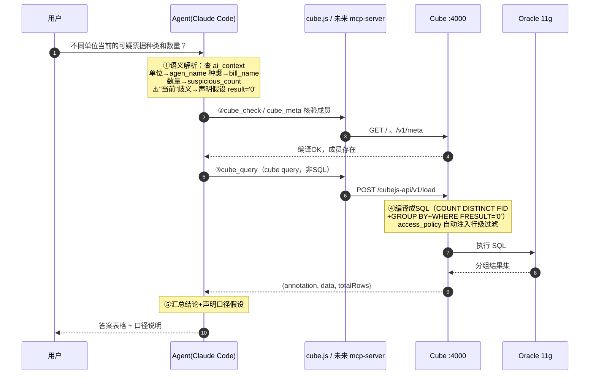

# 智能体问数功能（cube-ask）：五阶段流程与准确性保障

> **关联**：本文是 [cube-agent-architecture.md](cube-agent-architecture.md) 中
> "A 泳道：对话取数"的运行时细化——架构文档回答**组件间怎么连接**，
> 本文回答**一次问答内部怎么保证算得对**。
>
> **前提**：直接使用已建模的模型（建模流程见 `cube-modeling` skill）；
> 智能体以 Claude Code（CC）为例，其他编排 agent 同理。

---

## 一、实例走查：从提问到答案

问："**不同单位当前的可疑票据种类和数量**"（模型：`conf/model/cubes/facts_stock/suspicious.yml`，实测于 2026-09-22）

### 五个阶段

| 阶段 | 内容 | 执行者 |
|---|---|---|
| ① 语义解析 | 自然语言 → 语义层成员，依据是建模时写下的 `meta.ai_context` | LLM |
| ② 成员核验 | `cube_check` / `cube_meta` 确认成员真实存在，防引用幻觉 | 机械 |
| ③ 组装 query | 写 cube query（不是 SQL），按固定规则 | LLM + 规则 |
| ④ Cube 执行 | 编译成 SQL、access_policy 注入行级权限、发 Oracle | 机械（server 侧） |
| ⑤ 汇总回答 | 只基于返回数据计算 + 口径声明 | LLM + 纪律 |

### 阶段 ① 的映射表（查询计划的雏形）

| 自然语言 | 映射到 | 依据 |
|---|---|---|
| 不同单位 | `suspicious.agen_name` | ai_context："单位名称走 agen_name" |
| 种类 | `suspicious.bill_name` | ai_context + bill_id 已 public:false |
| 数量 | `suspicious.suspicious_count` | ai_context："可疑票据数用 suspicious_count" |
| **当前** | **⚠️ 歧义，需拍板** | ai_context 提供两个口径（见下） |

**"当前"的口径决策**：模型自含两套状态维度——
- 处理结果视角：`result = '0'`（可疑中，未解除）← 本例采用
- 流转状态视角：`status ∈ {'0','1'}`（未通知+待说明，对应 `pending_count`）

### 阶段 ③ 的实际 query

```json
{
  "measures":    ["suspicious.suspicious_count"],
  "dimensions":  ["suspicious.agen_name", "suspicious.bill_name"],
  "filters":     [{"member": "suspicious.result", "operator": "equals", "values": ["0"]}],
  "order":       {"suspicious.suspicious_count": "desc"},
  "limit":       100
}
```

### 阶段 ④ 语义层自动做的事（agent 不用管）

- **行级权限**：cube 配了 access_policy——调用带 `securityContext.region_code`
  （如 530100）时 WHERE 自动注入区划过滤，"不同单位"范围静默收敛到该区划；
  dev 模式 apiSecret 无 securityContext → `allow_all` 分支
- **脱敏**：`payer_name` 的 mask 对任何请求方只露 `**末2字`

### 阶段 ⑤ 实际返回（节选）

| 单位名称 | 票据种类 | 可疑票据数 |
|---|---|---|
| 云南医保测试单位改名 | 云南省医疗门诊收费票据 | 10021 |
| 云南医保测试单位改名 | 云南省医疗住院收费票据 | 2272 |
| 云南考试院测试0615 | 测试-云南省政府非税收入统一票据（电子） | 1544 |

答案末尾必须带口径声明："当前 = 处理结果为'可疑中'（result='0'，未解除）"。

### 时序图



### 走查要点

1. **没走 db.js 摸表和交叉验证**——模型是 P4 定案交付的（建模时已用 db.js
   实查验证，注释记录了实测分布）。运行时查询的信任来自**建模时的验证 +
   编译器**，验证成本付一次，这是分层的好处。
2. **suspicious 没有交付 view**（views/ 只有 bill_kpi_view），直接查 cube 层
   `suspicious.*`——与 bill_kpi 的"view 交付"风格并存，后续统一交付面是待办。
3. **"当前"的歧义是真实的准确率风险**：若用户实际想问 pending 口径
   （未通知+待说明），数字不同。靠下文的歧义处理协议解决。

---

## 二、准确性风险分布：把 LLM 自由度压到最小

五个阶段里 LLM 的自由度分布不均，准确性设计 = 每段自由度压到最小 + 每段配机械校验：

| 阶段 | 性质 | 主要风险 | 准确性机制 |
|---|---|---|---|
| ① 语义解析 | **LLM，风险最高** | 口径歧义、选错度量 | ai_context 唯一依据 + 歧义必问/必声明 + 口径词典 |
| ② 成员核验 | 机械 | 引用幻觉（编造成员名） | 计划中每个成员必须在 meta 输出出现（2026-09-28 起为失败路径重入 gate：执行报错才进，正常返回不跑）；失败按 a 拼写幻觉 → b public:false（meta 不显示非 public 成员，读 yml 确认）→ c view 交付面缺失（改用 cube 层成员）→ d 真没建模（默认"查不了"+缺口，三档处置均需用户拍板，不允许自动升级建模）逐序诊断 |
| ③ 组装 query | 半 LLM | 拼错 JSON、漏 limit、filter 写法错 | 固定组装规则 + Cube schema 校验兜底（未知成员服务端报错） |
| ④ Cube 执行 | 机械（server 侧） | 编译错、RLS 误配 | 报错对照表闭环；RLS 是配置问题不是查询问题 |
| ⑤ 汇总回答 | **LLM，风险次高** | 编数字、占比用截断数据、不声明口径 | 只用返回 data 计算 + totalRows 截断检查 + 口径声明强制 |

**关键洞察**：②④ 已是机械的，不需要新设计；**准确性设计的全部子弹打在 ①⑤**，
③ 加规则即可。

---

## 三、四条核心机制

### 1. 查询计划前置（治①）

执行任何查询前，必须先产出并展示**查询计划表**（即上文映射表的样子）：
每个自然语言成分 → 成员 + 依据，歧义处显式标记。作用：
- 给用户一个**可纠正的中间产物**（口径错了一眼能看出来）
- 给阶段②提供**可核验的清单**（逐项对 meta 核验）

### 2. 歧义处理协议 + 口径词典（治①，最重要的准确率杠杆）

规则硬化成三选一，**不允许静默选择**：
- **ai_context 给了多个口径选项**（如"当前"的两个状态维度）→ 先查口径词典，
  词典有约定则直接用并声明；词典没有 → `AskUserQuestion` 让用户拍板
- **ai_context 只有一个明确口径** → 直接用，答案末尾声明
- **ai_context 没覆盖** → 必须问，不允许猜

**口径词典**（`references/口径词典.md`）：业务高频词 → 项目级约定
（"当前"=result'0'、"在途"=…、"累计"=…）。词典把"人每次拍板"沉淀成
"项目记忆"，问得越多词典越准。

### 3. 数字纪律（治⑤）

三条铁律，全是 LLM 爱犯的：
- **只基于返回的 `data` 行计算**（占比、合计、极值），绝不凭记忆补数
- **要合计/占比时单独发不带 dimensions 的查询**拿全量数字——
  **不能把截断的 100 行加总当总数**（最隐蔽的错法）
- `totalRows > limit` 时答案必须标注"仅展示前 N / 共 M 组"

### 4. 问数日志（治"说不清当时怎么算的"）

每次问答追加一行 JSONL 到 `logs/qa-log.jsonl`（14 号日志规格迁移，原 regress/）
（问题、查询计划、最终 query、口径假设、时间）。价值：
- **审计追溯**：数字被质疑时能还原当时的口径
- **口径歧义考古**：积累后，高频歧义词进口径词典
- **高频问法沉淀为回归用例**：常被问的 query 进 `regress/*.queries.json`，
  口径变更时 diff 拦住——问数和回归两套体系接上

---

## 四、落地形态：cube-ask skill 与文件布局

> **已实现（2026-09-22）**：`.claude/skills/cube-ask/`（SKILL.md 契约 +
> references/口径词典.md 首批词条"当前" + references/qa-example.md 示范案例），
> 问数日志已启用（`logs/qa-log.jsonl` 首条为 suspicious 实例）。
> 实现时修正一处设计假设：`cube.js meta` 输出成员自带 `cube.member`
> 全名前缀（原以为不带），核验对照更直接；但 meta 端点不输出 ai_context，
> 故第1步口径依据固定为读模型 yml 文件。

```
.claude/skills/cube-ask/
  SKILL.md              # 契约：五步流程、歧义决策程序、数字纪律、交叉验证触发规则
  references/
    口径词典.md          # 数据：业务词 → 口径约定，越用越厚
    qa-example.md       # suspicious 实例（查询计划表/口径声明长什么样）
```

### 契约与数据分离（skill 每次触发整体载入上下文，放不变的东西）

| 内容 | 性质 | 放哪 |
|---|---|---|
| 歧义**决策程序**（词典有→用并声明；没有→必问） | 规则，几乎不变 | `SKILL.md` |
| 口径**词典内容**（"当前"=result'0'…） | 数据，随使用增长 | `references/口径词典.md` |
| 问数日志 | 运行时数据，无限增长 | `logs/qa-log.jsonl`（绝不进 skill） |
| 交叉验证**触发规则**（金额/对外数字必对数） | 规则 | `SKILL.md` 第5步 |
| 交叉验证**做法**（db.js 直查 vs cube.js 比对） | 已存在 | 引用 cube-modeling ③-4 关3，不重复写 |

词典单独成文件的三个理由：上下文成本（几十条后全量载入浪费）、
维护归属不同（流程 vs 业务备忘，改动频率差一个量级）、可审计
（显式的"业务口径备忘录"）。

### 口径信息的三层结构

```
SKILL.md 歧义程序      → 决定"怎么选"（问用户 / 查词典 / 按 ai_context）
  └─ 口径词典           → 跨 cube 的项目级约定（业务词 → 成员/过滤条件）
       └─ 模型 ai_context → 单 cube 内的成员口径（建模时写死的说明书）
```

**优先级规则**（写进 SKILL.md）：ai_context 是成员语义的**唯一真相**
（词典只能引用成员、不能发明成员）；词典负责把业务词映射到 ai_context
提供的选项上；两者冲突时以 ai_context 为准并提示用户更新词典。

### skill 流程骨架

```
第0步  cube.js check（模型必须编译正常才继续；桥注入预置上下文时跳过）
第1步  语义解析 → 产出查询计划表（含歧义标记）→ 歧义走词典/AskUserQuestion
第2步  按规则组装 query（必带 limit/order；filter 只用 member/operator）
第3步  执行；报错走对照表；totalRows>limit 标记截断
第4步  （条件步：执行报错才进）cube.js meta <cube> 核验计划中每个成员——
       修正后计划须 meta 通过才允许重查（重入 gate）
第5步  （条件步：高风险才做）db.js 对数，通过 → 答案标注"已与 Oracle 对数一致"
第6步  按数字纪律组织答案 + 口径声明 + 追加 qa-log
```

**与五阶段的对应关系**（2026-09-28 修订：skill 步骤重排为主链四步+两条件步）：

| 五阶段（概念/信息流） | skill 步骤（可执行契约） | 叠加的保障 |
|---|---|---|
| —（新增前置条件） | 第0步 check | fail fast：编译不过不进入解析 |
| ① 语义解析 | 第1步 语义解析→查询计划表+歧义处理 | 机制1 计划前置；机制2 歧义协议+词典 |
| ③ 组装 query | 第2步 组装规则 | 必带 limit/order；filter 只用 member/operator |
| ④ Cube 执行 | 第3步 执行 | 报错对照表闭环；totalRows 截断标记 |
| ② 成员核验 | 第4步（条件：执行报错才进）meta 核验+失败诊断 | 重入 gate：修正后计划须 meta 通过才重查，成员不在 meta 输出即停 |
| —（新增保障） | 第5步（条件：高风险才做）db.js 对数 | 引擎执行一致性；通过标注"已与 Oracle 对数一致" |
| ⑤ 汇总回答 | 第6步 答案纪律 | 机制3 数字纪律；机制4 qa-log |

两套编号视角不同：**五阶段是信息流概念模型**（含 server 内部环节——SQL 编译、
RLS 注入、Oracle 执行，agent 不可见也不可操作），用来分析准确性风险在哪；
**skill 步骤只写 agent 的可执行动作**，每步 = 对应概念阶段 + 该阶段的保障机制。
五阶段里 check 原被揉在②中，skill 将其提前为第0步（fail fast）。
2026-09-28 修订：原"第2步 meta 硬 gate（每查必跑）"改为**失败路径的重入 gate**
（query 正常返回不跑，报错才进，修正后须 meta 通过才重查）——meta 能拦的四种
失败（拼写幻觉/public:false/view 缺口/真没建模）query 报错同样暴露，前置检查
在成功路径上是纯税；高风险对数从答案纪律中拆出单独成步（第5步），置于答案
交付之前（不一致不得交付）。修订背景见 11 号 v2 修订注。

---

## 五、已定决策

1. **歧义默认策略**：词典优先——词典有约定直接用并声明，词典没有才问。
   避免同一问法问十次的烦躁；词典第一批词条从 suspicious 的"当前"歧义开始。
2. **交叉验证默认关闭**：已交付模型默认信任（建模时验过）；涉及**金额、
   对外汇报**的数字触发"高风险必对数"（db.js 直查 Oracle 比对一次），
   触发规则写在 SKILL.md 第5步。
3. **先 skill 契约、后 MCP**：MCP 化是体验升级不是准确性升级——②③④ 的
   机械校验 Bash 和 MCP 都能做，准确性增量全在 skill 契约里。
   零新代码（复用 cube.js），跑起来有痛点再 MCP。
